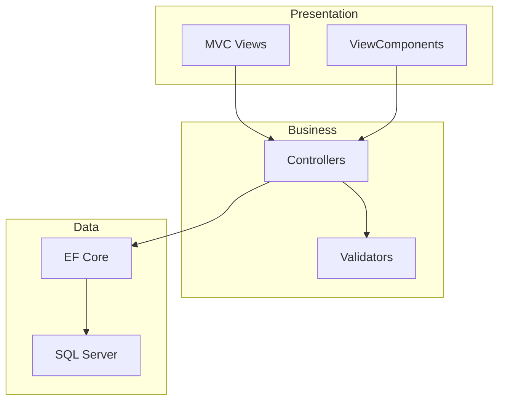

# Villa Agency

> Villa kiralama ve satışı için emlak portali. ASP.NET Core 9 ile geliştirilmiştir. 60 saniyede keşfet.

## What it is

Villa Agency, lüks villa ilanlarını listeleyen, filtreleyen ve detay sayfaları sunan bir emlak web uygulamasıdır. ASP.NET Core MVC, Entity Framework Core ve ASP.NET Core Identity kullanır.

## Features

- Villa listeleme ve detay sayfaları
- Konum, fiyat ve özellik filtreleme
- Kullanıcı kayıt / giriş (Identity)
- İletişim formu
- Responsive tasarım (Bootstrap)
- ViewComponents ile modüler yapı

## Tech Stack

- **Framework:** ASP.NET Core 9.0 MVC
- **ORM:** Entity Framework Core 9
- **Database:** SQL Server (LocalDB)
- **Auth:** ASP.NET Core Identity
- **Validation:** FluentValidation
- **UI:** Bootstrap, jQuery, Owl Carousel

## Architecture



## Run Locally

### Manuel Kurulum

```bash
git clone https://github.com/dugerdev/VillaAgency.git
cd VillaAgency
```

`appsettings.json` içinde ConnectionStrings'i düzenleyin:

```json
"ConnectionStrings": {
  "DefaultDb": "Data Source=(localdb)\\MSSQLLocalDB;Initial Catalog=VillaAgencyDb;..."
}
```

```bash
dotnet ef database update
dotnet run
```

Tarayıcıda: `https://localhost:7xxx` (launchSettings'teki port)

## Live Preview

🔗 [Demo](https://github.com/dugerdev/VillaAgency) *(deploy URL eklenebilir)*

## Test / CI

- **Test:** `dotnet test` *(test projesi varsa)*
- **CI:** GitHub Actions ile otomatik build

## Repo Hijyeni

- [x] `.env.example` – Ortam değişkenleri şablonu
- [x] `LICENSE` – Lisans dosyası
- [x] `.gitignore` – Gereksiz dosyalar hariç

---

## .env.example

.NET projeleri `appsettings.json` kullanır. Docker veya ortam değişkenleri için örnek:

```
ConnectionStrings__DefaultDb=Server=localhost;Database=VillaAgencyDb;Trusted_Connection=True;TrustServerCertificate=True
ASPNETCORE_ENVIRONMENT=Development
```

## License

MIT License – detaylar için [LICENSE](LICENSE) dosyasına bakın.
